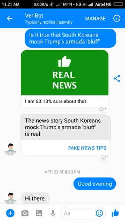

VeriBot
======
This repository contains content for "VeriBot", a fake news classification bot I entered for the [Facebook Bots for Messenger Challenge]( https://messengerchallenge.splashthat.com/)

### Try VeriBot
<a href="http://m.me/veribot" target="_blank">Say hello</a>

### Description
VeriBot is a bot developed to address the tide of fake news by employing machine learning classification to determine the veracity of news stories.
It accepts a news story as input in the form of a headline or snippet and passes it through a trained model to get a prediction based on two possible class labels, real or fake. VeriBot also returns a confidence score which is a percentage of the accuracy of each prediction.
VeriBot can be used to check a news story by typing, "Is it true that" followed by the headline or snippet like so, "Is it true that South Koreans mock Trump's armada 'bluff'". This message sent by the user would be parsed using natural language processing to get the input and the model would return a prediction.

### Credits
I found the following resources particularly helpful.
1. George McIntire's post 
[On Building a “Fake News” Classification Model](https://opendatascience.com/blog/how-to-build-a-fake-news-classification-model) in Open Data Science.
The fake news dataset for the post is the one I used to train my model and it can be found on [GitHub](https://github.com/GeorgeMcIntire/fake_real_news_dataset).
2. Tomomi Imura's tutorial - [Creating a Simple Facebook Messenger AI Bot with API.ai in Node.js](http://www.girliemac.com/blog/2017/01/06/facebook-apiai-bot-nodejs/)
3. [Facebook messenger platform documentation](https://developers.facebook.com/docs/messenger-platform)
4. Dagorham's GitHub [fake_news_analysis repository](https://github.com/dagorham/fake_news_analysis)